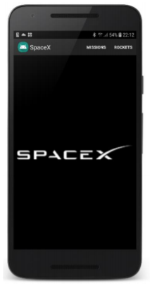
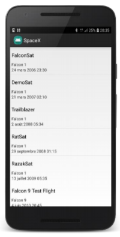
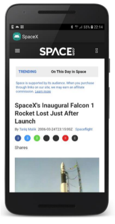
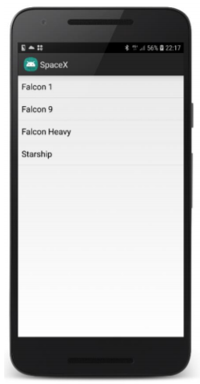
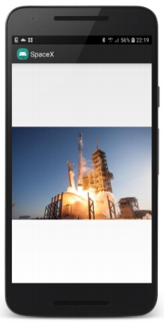

# SpaceX

SpaceX est une application réalisée dans le cadre de mon cours de développement Android en deuxième année d'école d'ingénieur à l'ISIMA. L'applcation est codée en Java grâce à Android Studio.

Cette application a pour but d'afficher les décollages et les fusées de SpaceX en récupérant les informations nécessaires sur un Web Service. 

L'application se compose de 5 activités. 

1. L'écran d'acceuil 

2. La liste des décollages des fusées 

3. Une page qui affiche les informations liées à un décollage 

4. La liste des fusées utilisées par SpaceX

5. Une gallerie d'image liées à une fusée particulière

